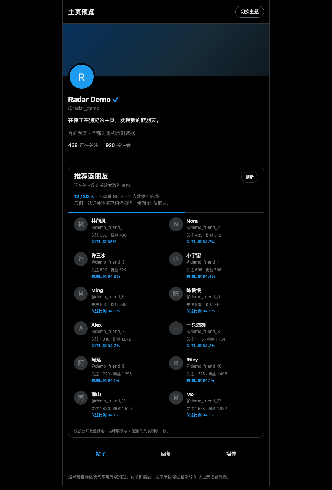

# 推荐蓝朋友 · X Premium Friends Radar

一个 Chrome Manifest V3 扩展。浏览 X 用户主页时，如果检测到该账号的蓝标 Premium 状态，扩展会扫描这个人的「认证关注者」，将符合下面条件的账号放在主页里的「推荐蓝朋友」区块：

```text
正在关注数 > 关注者数 × 80%
```

默认找到 20 人就停止。点击扩展图标，可以开关自动推荐，并把目标人数设为 1–20 人。推荐卡片显示头像、昵称、用户名、关注数和粉丝数，点击后打开对应的 X 主页。



[安装](#安装和首次使用) · [设置人数](#设置推荐人数) · [常见问题](#安装与使用常见问题)

## 安装和首次使用

使用 **桌面版 Chrome 120 或以上版本**。普通用户无需安装 Git、Node.js 或 npm，也无需运行构建命令；下载后即可加载。

### 1. 从 GitHub 下载

1. 打开本项目的 GitHub 仓库首页。
2. 点击文件列表上方的绿色 **Code** 按钮。
3. 点击 **Download ZIP**，下载完整项目。
4. 将下载的ZIP压缩包解压。

或使用 Git 获取完整源代码：
```bash
git clone https://github.com/cc558/x-premium-friends-radar.git
```

### 2. 加载到 Chrome

1. 新建 Chrome 标签页，在地址栏输入 `chrome://extensions`，按回车。
2. 打开页面右上角的 **「开发者模式」**。
3. 点击 **「加载未打包的扩展程序」**（英文界面为 **Load unpacked...**）。
4. 选择上一步找到的 **`extension` 文件夹**。
5. 页面出现 **「推荐蓝朋友 · X Friends Radar」** 卡片，且开关处于开启状态，说明扩展已加载。
6. 点击 Chrome 工具栏的拼图图标，在扩展列表中找到「推荐蓝朋友」，点击旁边的图钉将它固定到工具栏。

### 3. 首次使用

1. 在安装扩展的 **同一个 Chrome 用户资料** 中打开 [X](https://x.com) 并登录。
2. 点击工具栏上的「推荐蓝朋友」图标，确认 **「自动推荐」已开启**，人数为默认的 **20**。如果改动了开关或人数，点击 **「保存设置」**。
3. **刷新已经打开的 X 页面**，让刚安装的扩展开始在页面中运行。
4. 打开一个带蓝勾的用户主页，留在该主页等待「推荐蓝朋友」区块出现。
5. 区块会显示扫描进度，并逐步展示符合条件的头像和昵称。点击推荐卡片可以打开对应账号的主页。

扫描时会打开一个**不抢焦点的后台 X 标签页**，读取这个人的「认证关注者」并自动向下滚动。正常结束后，扩展会关闭扫描页；如果你主动把扫描页导航到了其他页面，扩展会保留该标签页。请让 Chrome 保持运行，手动关闭扫描页或离开原用户主页会停止本次扫描。

扫描过程中可以点击区块里的 **「停止」**；结束后点击 **「刷新」** 或 **「重试」**，即可重新扫描当前主页。没有蓝勾的主页不会自动展示推荐区块。

## 设置推荐人数

点击工具栏上的「推荐蓝朋友」图标，在「每次推荐人数」中输入 **1–20 的整数**，然后点击 **「保存设置」**。默认值为 20，找到目标人数后停止；列表不足或扫描提前结束时会显示已找到的结果。

关闭「自动推荐」并保存，可以暂停自动扫描。自动推荐开启时，保存新人数会停止旧任务，并按新设置重新扫描当前蓝标主页。

## 安装与使用常见问题

| 遇到的情况 | 处理方法 |
| --- | --- |
| 加载时报「未找到清单文件」或「无法加载清单」 | 确认 ZIP 已完整解压，选择的是直接包含 `manifest.json` 的 `extension` 目录。不要选择项目最外层。 |
| 报找不到某个脚本或图标 | 重新下载并完整解压；保留 `extension` 里的所有文件和子目录。 |
| 找不到扩展图标 | 打开工具栏的拼图菜单，将「推荐蓝朋友」固定到工具栏。 |
| 装好了，但 X 主页没有推荐区块 | 先刷新 X 页面，确认扩展与「自动推荐」均开启；确认在同一 Chrome 用户资料中登录 X，并打开的是带蓝勾的用户主页。也可在扩展「详细信息」中确认已允许访问 `x.com` / `twitter.com`。 |
| 显示未收到数据、无法访问或要求登录 | 先手动打开该账号的「认证关注者」列表，确认当前登录账号可以查看；之后回到主页点击「重试」。 |
| 找到的人少于设置数量 | 只有符合比例且计数完整的账号会被推荐。列表读完、扫描上限、手动停止或 X 限流，都可能让结果少于目标人数。 |
| 扫描页突然多出来或自动关闭 | 这是扩展读取认证关注者的正常过程；无需操作该标签页。 |
| 更新后还是旧界面，或操作没有响应 | 先在扩展管理页重新加载扩展，再刷新 X 页面。 |

如果仍有问题，可以到本仓库的 **Issues** 反馈，并附上 Chrome 版本、扩展版本、具体操作步骤和报错文字。

## 筛选口径

- Premium 触发条件取自 X 个人资料响应中的 `is_blue_verified === true`。旧的 `verified` 字段不作为依据。
- 这个字段表示公开蓝标状态，不能证明用户实际付费订阅。组织附属账号也可能获得蓝勾，订阅审核期间可能暂时没有蓝勾。扩展因此无法完整识别所有订阅者。[X 官方 Premium FAQ](https://help.x.com/en/using-x/x-premium-faq)
- 候选人来自 X 返回的「认证关注者」列表，**不再额外要求候选人拥有蓝勾**。筛选只依据关注数和粉丝数，顺序与 X 返回的列表一致。
- 比较是严格大于：关注 800 人、粉丝 1,000 人不通过；关注 801 人、粉丝 1,000 人通过。
- 粉丝为 0 时，关注数大于 0 就通过；两项都为 0 时不通过。缺失或无效的数量会跳过，不按 0 处理。使用响应中的完整整数，不使用页面上「1.2 万」等缩略文字计算。
- 这是数量条件筛选。扩展不会判断账号是否真实、是否愿意回关，也不会替你关注任何账号。

## 停止条件和故障处理

除找到目标人数外，列表读完、无法继续分页、用户停止、来源页面离开、标签页关闭或 X 返回登录/权限/限流错误，都会结束本次扫描。为避免无限扫描，每次任务还设有 **3 分钟、100 页和 3,000 名已查看用户**的上限。达到上限时显示已经找到的结果，因此最终人数可能少于设置值。

遇到问题时：

- 确认已经在当前 Chrome 用户资料中登录 X，并能手动打开目标账号的「认证关注者」列表。
- 私密、被停用、无法访问的账号，以及当前登录账号没有权限查看的列表，可能无法扫描。
- X 限流后先等待，再点击「重试」。不要反复刷新制造更多请求。
- 扩展更新后，在扩展管理页点击重新加载，再刷新 X 页面。
- X 更改页面结构或响应字段时，解析可能失效，需要更新扩展。扫描使用 X 网站的实际响应，不保证这些内部字段长期稳定。

## 数据与权限

无需 X API key，不需要粘贴 Cookie、Token 或密码。扩展利用 X 网页已经发出的请求，提取用于筛选的头像、账号名称、用户名、计数和分页信息；不复制认证请求头，也不把这些数据发送到外部服务器。

设置和任务状态由 Chrome 扩展存储维护。后台标签页使用当前登录会话，因此结果以这个会话实际可访问的内容为准。扩展仅用于读取和展示，不提供关注、点赞、评论或消息发送功能。

设置保存在 `chrome.storage.local`；扫描状态和结果保存在 `chrome.storage.session`，浏览器重启或扩展重新加载后清除。同一时刻只运行一个扫描任务，其余主页的任务排队，避免并发加载过多列表。修改设置会停止旧任务；自动推荐开启时，会按新设置重新扫描当前蓝标主页。

扩展采用 MAIN 内容脚本观察网页响应、ISOLATED 内容脚本管理扫描及主页区块、service worker 协调标签页。任务需要考虑后台 worker 的自动休眠；不能依靠内存变量永久保留状态。[Chrome 内容脚本说明](https://developer.chrome.com/docs/extensions/develop/concepts/content-scripts)、[service worker 生命周期](https://developer.chrome.com/docs/extensions/develop/concepts/service-workers/lifecycle)

## 验证范围

已通过 45 项自动化测试，覆盖数量比例边界、字段缺失、用户去重、分页结束、达到人数后停止、路由切换、任务取消、后台状态恢复及配置权限。已在独立 Chrome 浏览器中验证推荐区块挂载、主题适配、昵称与头像的安全处理、停止按钮及配置保存。

完整 MV3 测试 `tests/extension.e2e.mjs` 已在 Chrome 154.0.8037.98 中通过：真正加载扩展，在本地 HTTPS 模拟的 X 主页触发扫描，滚动读取两页数据，恰好展示 20 位推荐，自动关闭扫描页，并在真实工具栏弹窗里保存新的目标人数。浏览器资料、证书和服务器都仅用于这次独立测试，结束后清理。

这些测试使用模拟页面和虚构数据，尚未验证真实 X 登录会话。真实 X 的页面和响应结构仍可能与测试样例不同。

真实使用还需要在安装扩展后检查：已登录与未登录、蓝标与非蓝标主页、访问受限的列表、从一个主页切换到另一个主页、后台扫描标签页关闭，以及浅色/深色主题。Chrome 的 service worker DevTools 会影响 worker 生命周期，验证休眠恢复时应关闭它。

## 本地开发

扩展本身不需要构建或安装 npm 依赖，`extension/` 就是完整可加载目录。

```sh
node --test tests/*.test.mjs
node scripts/check.mjs
node scripts/package.mjs
```

修改 `extension/shared/core.js` 后，先运行 `node scripts/sync-core.mjs` 同步 MAIN 脚本副本。检查脚本会验证两个执行环境使用独立资源路径，且核心代码保持一致。

最后一条命令生成 `dist/x-premium-friends-radar.zip`，解压后选择其中的 `extension/` 文件夹加载。打包脚本使用系统的 `zip` 命令。

发布 GitHub Release 时，可将这个 ZIP 作为 **Assets** 附件上传。`dist/` 已被 `.gitignore` 忽略，推送源码不会自动上传安装包；源码 ZIP 本身也能直接安装，无需构建。

可选界面回归测试：`node tests/ui.e2e.cjs`。它使用已安装的 Playwright 和 Chrome，支持用 `CODEX_NODE_MODULES` 与 `CHROME_EXECUTABLE_PATH` 指定路径。完整扩展测试支持 `BLUE_FRIENDS_PLAYWRIGHT` 和 `BLUE_FRIENDS_BROWSER`。两者都使用独立临时浏览器资料和模拟响应，不使用日常 Chrome 的登录资料。

`examples/demo.html` 是无需安装扩展即可打开的外观预览，全部为虚构示例数据。
